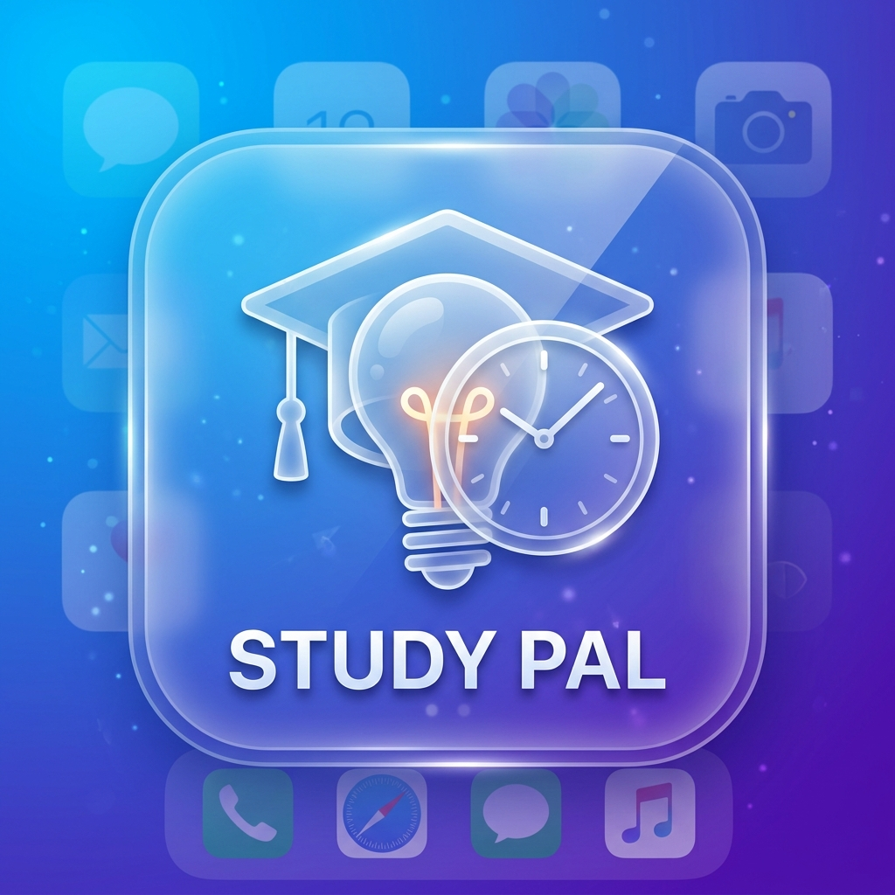

# 🎓 Study Pal - Your Ultimate Learning Companion



Study Pal is a comprehensive iOS application designed to help students manage their academic life efficiently. From tracking tasks and grades to staying focused with a built-in study timer and flashcards, Study Pal brings all your educational tools into one sleek, glassmorphic interface.

---

## ✨ Key Features

### 📅 Task Management
- Create, update, and organize your academic tasks.
- Set priorities and deadlines to stay on top of your schedule.
- Siri integration for hands-free task creation.

### ⏱️ Focus Timer & Live Activities
- Pomodoro-style timer to boost productivity.
- Real-time synchronization with Firebase.

### 📊 Focus Insights
- Visualize your study patterns with real-time data.
- Track total focus time and daily productivity metrics.
- Seamlessly synced with your cloud profile.

### 🃏 Flashcards
- Create custom flashcards for different subjects.
- Interactive study mode with flip animations.
- Native date pickers for organized learning sessions.

### 📈 Grade Tracking
- Monitor your academic performance across all subjects.
- Local and push notifications for grade updates and reminders.

### 🔐 Security & Profile
- **Biometric Authentication** (Face ID / Touch ID) to keep your data private.
- Profile with editable details.
- Real-time notifications and alerts.

### 🎮 Gamification
- Earn streaks and levels as you complete tasks and study sessions.
- In-app games to take a break while keeping your mind sharp.

---

## 🛠 Tech Stack

- **Framework:** SwiftUI (iOS 16.4+)
- **Backend:** Firebase (Firestore, Authentication, Cloud Messaging)
- **Architecture:** MVVM (Model-View-ViewModel)
- **APIs & Frameworks:**
  - `ActivityKit` (Live Activities)
  - `AppIntents` (Siri & Shortcuts)
  - `LocalAuthentication` (Face ID/Touch ID)
  - `UserNotifications` (Local & Push Notifications)

---

## 🚀 Getting Started

### Prerequisites
- **Xcode 15.0** or later.
- **iOS 16.4+** compatible device or simulator.
- A **Firebase Project** (if you wish to use your own backend).

### Installation Steps

1. **Clone the Repository:**
   ```bash
   git clone https://github.com/ShafranSheikh/Study-Pal.git
   cd "Study Pal"
   ```

2. **Open the Project:**
   Open `Study Pal.xcodeproj` in Xcode.
   ```bash
   open "Study Pal.xcodeproj"
   ```

3. **Configure Firebase:**
   - The project includes a `GoogleService-Info.plist`. To use your own Firebase instance:
     - Go to the [Firebase Console](https://console.firebase.google.com/).
     - Create a new project and add an iOS app.
     - Download the `GoogleService-Info.plist` and replace the existing one in the `Study Pal` directory.

4. **Select Target & Run:**
   - Select your preferred Simulator or a physical iOS device.
   - Press `Cmd + R` or click the **Play** button in Xcode.

---

## 📂 Project Structure

```text
Study Pal/
├── Components/         # Reusable UI components
├── Containers/         # Feature-specific views (Home, Tasks, Timer, etc.)
├── Models/             # Data models
├── ViewModels/         # Business logic & state management
├── Services/           # Firebase & Local services
├── Intents/            # Siri App Intents
├── LiveActivity/       # Dynamic Island & Widget logic
├── Utils/              # Helpers & Extensions
└── Assets.xcassets/    # Images, Colors, and App Icons
```


Developed by [Mohamed Shafran](https://github.com/ShafranSheikh)
